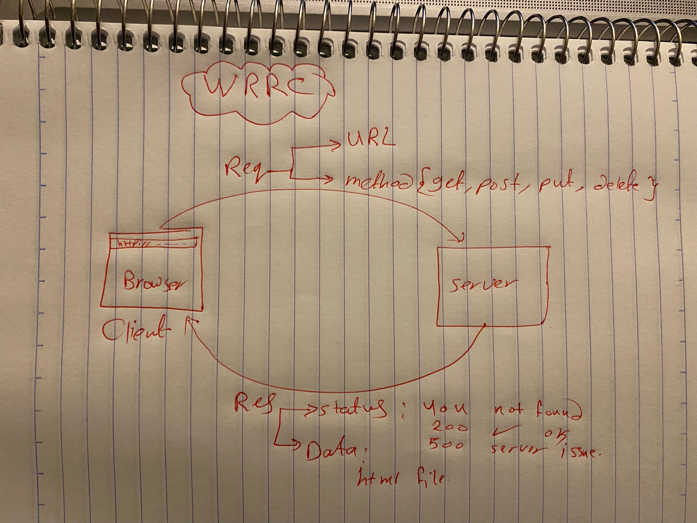

# Movies-Library

# Project Name: Movies-Library - Project Version: Version 1

**Author Name**: Tasneem maqableh

## WRRC
;

## Overview
there are two pages:
1. Home page
2. Favorite page

## Getting Started
1.npm init -y // -y means --yes
2.create an index.js , name is optional
3.Install express package to use itnpm install express
4.added the server code inside index.js
5.run the server using node index.js

## Project Features
1. Home page: included title
2. constructor , post path and favorite page